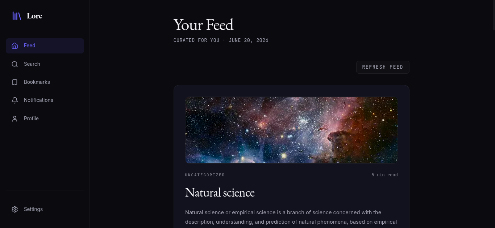

<div align="center">
  <h1>📖 Lore</h1>
  <p><strong>Wikipedia as a Social Experience.</strong><br/>
  <i>The world's smartest feed. A place where scrolling makes you smarter.</i></p>
</div>

<br />



> **Lore** is a next-generation knowledge discovery platform that reimagines Wikipedia as an intelligent, personalized social media feed. Where platforms like X.com, Instagram, and TikTok compete for attention with noise, Lore competes with *signal* — surfacing humanity's most verified, deep knowledge in a format engineered for modern consumption.

## ✨ Features

- **Intelligent Algorithm:** A multi-signal scoring engine with an interest graph, serendipity injection, and TF-IDF semantic similarity.
- **Dark Editorial Design:** A beautiful, focus-driven UI built with Tailwind CSS, featuring EB Garamond for a premium reading experience.
- **Cinematic Motion:** Powered by Framer Motion (UI fabric) and GSAP (signature cinematic moments like the Knowledge Graph visualization).
- **Personal Knowledge Base:** Bookmarks, reading history, weekly digests, and topic following.
- **Social Sharing:** X/Twitter thread auto-generator, WhatsApp OG share cards, and Instagram Story generators.
- **PWA & Offline Support:** Native-like experience with offline caching for your recent articles and bookmarks.

## 🛠️ Tech Stack

Lore is built on a modern, bleeding-edge stack:

- **Framework:** Next.js 16 (App Router)
- **Language:** TypeScript (Strict Mode)
- **Styling:** TailwindCSS + CSS Variables
- **Database:** PostgreSQL + Prisma ORM
- **Authentication:** Auth.js v5
- **Caching:** Upstash Redis
- **Motion:** Framer Motion + GSAP
- **Security:** Arcjet Rate Limiting
- **Analytics:** PostHog

## 🚀 Getting Started

Follow these steps to run Lore locally.

### Prerequisites

- Node.js 20+
- `pnpm` (This project uses `pnpm` exclusively)
- PostgreSQL (running locally or via Docker)

### 1. Clone the repository

```bash
git clone https://github.com/Gito125/lore.git
cd lore
```

### 2. Install dependencies

```bash
pnpm install
```

### 3. Setup Environment Variables

Copy the example environment file and fill in your details (Database URL, Auth secrets, etc.):

```bash
cp .env.example .env.local
```

### 4. Setup Database

Initialize the Prisma client and push the schema to your database:

```bash
pnpm prisma generate
pnpm prisma migrate dev
```

### 5. Start the Development Server

```bash
pnpm dev
```

Open [http://localhost:3005](http://localhost:3005) with your browser to see the result.

## 🧪 Testing

Lore maintains high test coverage to ensure a reliable experience:

- **Unit/Integration:** `pnpm test` (Powered by Vitest)
- **E2E:** `pnpm test:e2e` (Powered by Playwright)

## 🗺️ Architecture & Documentation

For a deeper dive into how Lore is built, check out our documentation:

- [Vision & Strategy](./docs/01-vision.md)
- [Mini SRS](./docs/02-mini-srs.md)
- [Architecture Overview](./docs/03-architecture.md)
- [Design Philosophy](./docs/04-design.md)
- [Folder Structure](./docs/05-folder-structure.md)
- [Build Log & Progress](./docs/PROGRESS.md)

## 🤝 Contributing

Contributions are welcome! Please read through our documentation and check the `PROGRESS.md` to see what we're currently working on. Ensure you follow our strict agent guidelines outlined in `AGENTS.md`.


## 📄 License

This project is licensed under the MIT License - see the LICENSE file for details.
